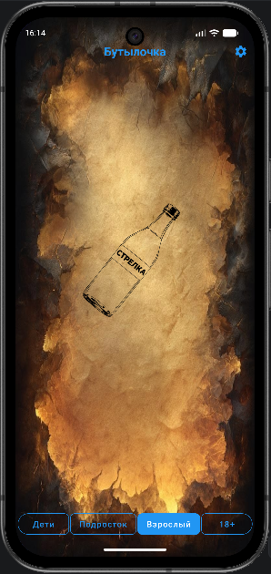

# 🍾 Игра "Бутылочка"

[](https://github.com/ВАШ_АККАУНТ/bottle-game/actions/workflows/ci.yml)

Мобильное приложение "Игра в бутылочку" с возрастными режимами и заданиями для разных категорий игроков.

## 📱 Возрастные режимы

| Возраст | Режим | Доступные задания |
|---------|------|-------------------|
| 0-9 лет | Детский | Веселые, безопасные задания |
| 10-15 лет | Подростковый | Интересные челленджи |
| 16-17 лет | Взрослый | Более смелые задания |
| 18+ | 18+ | Откровенные и пикантные задания |

## 🎮 Функционал

- ✅ Регистрация и вход (гостевой режим)
- ✅ 4 режима с разными заданиями
- ✅ Вращение бутылки с анимацией
- ✅ Смена темы оформления в зависимости от режима
- ✅ Сохранение прогресса при повороте экрана
- ✅ Безопасное шифрование данных пользователя(локальное хранение)
- ✅ Полная офлайн-работа (без интернета)

## 📸 Скриншоты

| Экран входа | Игровой экран | Настройки |
|-------------|---------------|-----------|
|  |  |  |

| Детский режим | Подростковый | Взрослый | 18+ |
|---------------|--------------|----------|-----|
|  |  |  |  |

## 🛠️ Технологии

- **Язык**: Kotlin
- **UI**: Material Design 3, ViewBinding
- **Хранение**: DataStore (Preferences)
- **Шифрование**: Google Tink + Android Keystore
- **Анимации**: ObjectAnimator
- **Архитектура**: MVVM, Clean Architecture

## 🚀 Сборка

### Требования
- Android Studio Hedgehog или новее
- JDK 17+
- Gradle 8.7+

### Локальная сборка
```bash
# Клонировать репозиторий
git clone https://github.com/ВАШ_АККАУНТ/bottle-game.git

# Перейти в папку проекта
cd bottle-game

# Собрать Debug APK
./gradlew assembleDebug

# Собрать Release APK
./gradlew assembleRelease
```

## 📦 Установка

### Android
1. Скачайте APK из [Releases](https://github.com/Wiktor-coder/Bottle/releases)
2. Разрешите установку из неизвестных источников
3. Установите приложение

### Из исходников
1. Откройте проект в Android Studio
2. Нажмите Run ▶️

## 👥 Команда
* Разработчик: Wiktor
* Дизайн: Wiktor

## ⭐ Если вам понравился проект, поставьте звезду на GitHub!

## 💖 Поддержать проект
Проект развивается исключительно на энтузиазме в свободное время. Любая сумма поможет оплачивать серверы и уделять коду больше времени. Благодарен за любую поддежку проекта.

Поддержать по ссылке: [CloudTips](https://pay.cloudtips.ru/p/29e9b5ab)

Поддержать по QR-code: 

📞 Контакты
Автор: [Wiktor-coder](https://github.com/Wiktor-coder)
Email: [apostal333@gmail.com](apostal333@gmail.com)


